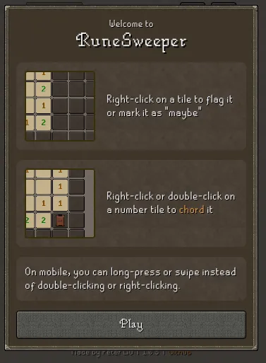

Summer is here, and welcome to the first issue of TorontoJS TL;DR. This is the Toronto Javascript newsletter, by you for you.

Our goal with this newsletter to is keep you apprised of what's going on with TorontoJS and provide a spotlight of your projects. If you have anything to share for the next edition, find us on the [TorontoJS slack](https://torontojs.slack.com/).

# Upcoming events

We got a packed schedule the next few weeks, with 4 TorontoJS events:

- [JS Social: Online - June 28](https://www.meetup.com/torontojs/events/mrmfftyfcjblc/) - TODAY!
- [JS Technical Interview Prep - June 29](https://guild.host/events/js-technical-interview-awf6em)
- [JS Code Club: Online - July 15](https://www.meetup.com/torontojs/events/dctzbtyfckbtb/)
- [JS Tech Talk: Web Fonts, Web Components, Svelte! - July 27](https://guild.host/events/js-tech-talk-web-fonts-l8sro4)

Also happening in Toronto that might be worth a look:

- [The React Developer's Guide to OAuth2 - June 29](https://www.meetup.com/toronto-react-native/events/294130639/) - TOMORROW! - Organized by the React + Native group.
- [Refactor DX - July 12-13](https://www.refactorconf.com/?lang=en) - A conference in Toronto about Developer Tooling. Use the "TORONTOJS" coupon code to get 30% off your ticket!

# Projects from the community

Peter Liu made a [Runescape-inspired Minesweeper game](https://petertyliu.github.io/runesweeper/). Did anyone else not know you could right-click to mark squares as bombs? When I first played this I just randomly pressed anywhere in hopes I would get it right.

Elizabeth McCready talks about creating desktop layouts from first principles in her article ["Creating a Simple Desktop Layout in CSS with Just an H1 and One Paragraph"](https://gingerkiwi.blog/blog/2023-06-13-creating-a-simple-desktop-layout-in-css-with-just-h1-and-one-paragraph/)

Philippe Schwyter shared that he's working on [a slack bot for generating images](https://cauli.projectzucchini.com/) like Giphy, but instead using DALL-E.

Marco Campos wrote about "[Web Components: A (Not So) Gentle Introduction](https://madcampos.dev/blog/2023/06/web-components-basics/)".

# What's new in Javascript?

We're getting a new keyword `using`, existing alongside `var`, `let` and `const`, which has the unique property that it lets library developers ‘do something' when a symbol goes out of scope.

The news is that this will be part of the next Typescript 5.2 release, and sparked some interesting discussions on the [TorontoJS Slack](https://torontojs.slack.com/). Read all about it on: [Total Typescript.](https://www.totaltypescript.com/typescript-5-2-new-keyword-using)

Last week, Svelte [released version 4](https://svelte.dev/blog/svelte-4) of their frontend framework. The release seems mostly incremental with a focus on performance improvements and the Developer experience.

# Jobs

If you have an open Job Posting relevant to the members of our community, please send an email to [events@torontojs.com](mailto:events@torontojs.com).

We'd love to link it in our next newsletter at no cost.
