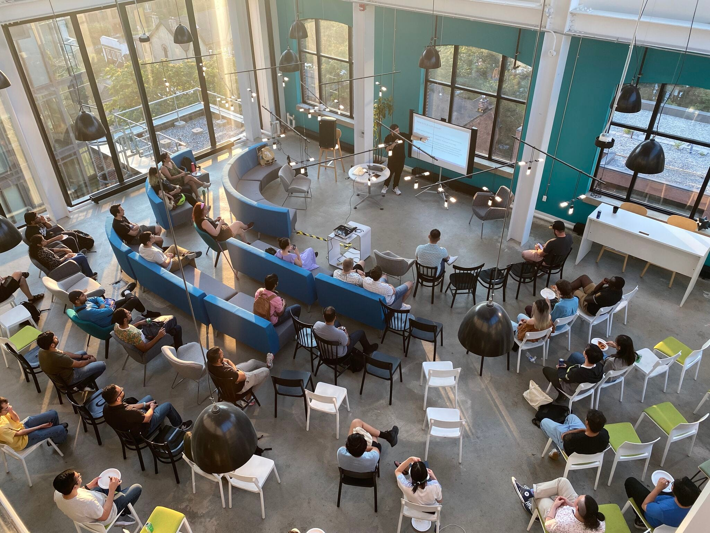
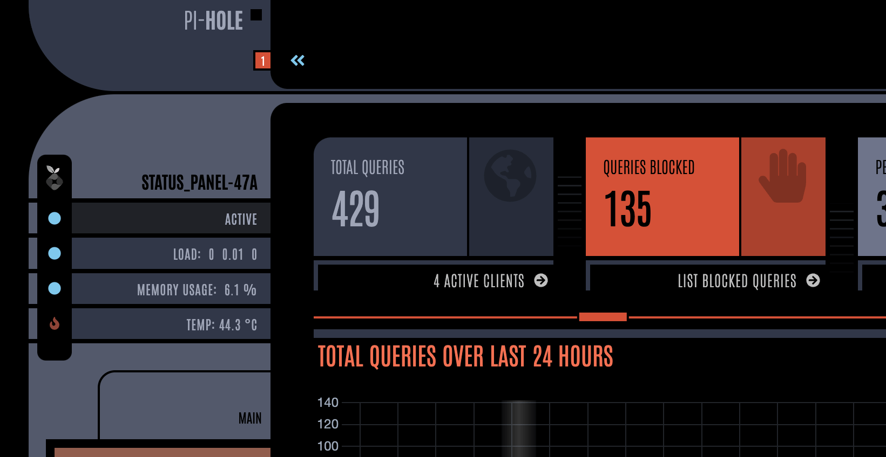

Normally summers are a bit quiet for events, but this year seems like an exception. We've had 6(!) TorontoJS events in the last 2 weeks and more on the way. Don't forget to touch grass!

JS Tech Talk event at Spaces. Photo by Tehseen Chaudhry.

# Upcoming events

We have the following TorontoJS events on the docket:

- Most Saturdays from 4pm-6pm Danny is hosting **JS Code Club: Online** on Zoom. This is a mob hacking event where 1 or more people bring projects or problems to work on together. I try to go every week as they're always inspiring and Danny is a great host. Look out for a link on the #events channel in Slack close to **August 12th** and **August 19th.**
- On **August 30th** we also have the monthly [JS Social: Online](https://guild.host/events/js-social-online-mrmfftyfclbnc) scheduled. A good place to meet like-minded individuals over a snack or drink from the comfort of your home.

Please look for our events calendar on [Guild](https://guild.host/torontojs/events) or [Meetup](https://www.meetup.com/torontojs/events/) for other events and more up to date information.

Also happening in Toronto:

- On **August 16th at 8pm** TechTank is hosting a panel: "[I made it through the HELLSCAPE that is job search](https://www.linkedin.com/posts/chris-ty-kim_techtank-hellscape-event-part-2-poster-activity-7091827332973268993-YV6a/?utm_source=share&utm_medium=member_desktop)" featuring 3 panelists [on Zoom](https://tdsb-ca.zoom.us/j/97802052905?pwd=SVBpS3k4cHZYbmk0U2EzYXQvM01TUT09). A topic a lot of us can relate to. TechTalk is fully community organized, without a commercial angle, so you can expect some honesty without being sold something.

# Happening in the community

[Peter Liu](https://www.linkedin.com/in/peter-ty-liu/) has built an incredible 3D model editor that uses CSS as a rendering engine.

<video controls>
  <source src="/assets/css-3d-model.mp4" type="video/mp4" />
  <a href="/assets/css-3d-model.mp4">Download the video</a>
</video>

You can play around with it [on his github pages website.](https://petertyliu.github.io/toaster/)

[Michal Svatoš](https://www.svatos.dev/) has been working on a [LCARS-inspired interface](https://github.com/MichalSvatos/pi-hole-star-trek-picard/) for his [Pi-Hole](https://pi-hole.net/). [LCARS](https://en.wikipedia.org/wiki/LCARS) is the fictional UI in 24th century Star Trek. It looks fantastic and wins Michal the inaugural "Nerd Of The Month award". Congratulations Michal!

A few of us also have started working on a public TorontoJS member website, where people in the community can create public profiles and show off their projects. It's early days, but there's a [Github Repo](https://github.com/torontojs/members). Join the Code Club if you want to pitch in!

# Industry news & hot takes

Stefan Judis shares a pretty cool (currently Firefox-only) feature to [make live minimaps on websites](https://www.stefanjudis.com/a-firefox-only-minimap/) using just CSS. Wild!

Spiffytech writes about [ways emoji's can be detected in strings](https://spiffy.tech/is-this-an-emoji).

# Jobs

If you have an open Job Posting relevant to the members of our community, please send an email to [events@torontojs.com](mailto:events@torontojs.com).

We'd love to link it in our next newsletter at no cost.

# Terminal Tip

You can use `!!` to repeat the last command. For example, if you forgot to run `sudo`, you can repeat the last command with `sudo !!.`
