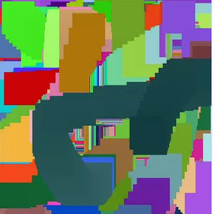

We made it all the way to issue 7, and dang is it hard to come up with an introduction for these that keeps it fresh. In fact, it's so difficult that every issue before this one had a mention of the weather! So, without further ado:

So the next 14 days we can expect temperatures up to 20 degrees during the day, with minimal precipitation. It's starting to be time for sweaters and light jackets again. I know that the idea of summer being over and winter is scary, but we're about to enter the prettiest time of the year with the best fashion so it's not all bad!

## Upcoming events

The next in person JS Tech Talk is on **September 27th.** There will be 3 talks:

- **Shruti Vellanki** - Integrating Accessibility into Your Developer Workflow.
- **Nik LeBlanc**, "DORA at DevCycle: Tracking engineering metrics that matter".
- **Rob Jackiewicz**, "Fast iteration cycles, how to get feedback and build the right thing".

So whether you're interested in accessibility, expressing the value your team creates through a discrete set of metrics or simply not being slow, there's something for you here! Last but not least, our very own [**Jen Chan**](https://jenchan.biz/) is sponsoring pizza for this event!

The number of seats for these events is usually limited, so you'll want to [RSVP](https://guild.host/events/js-tech-talk-in-person-yqdf9q) soon to ensure you have a spot!

---

A few weeks from now, on **October 4th** (🐈 World animal day! 🐕) we're also hosting: [Code & Communicate: a workshop for women developers](https://guild.host/events/code-communicate-a-workshop-vx61iq). The workshop covers topics like writing documentation and public speaking. Read all the details and RSVP on [guild](https://guild.host/events/code-communicate-a-workshop-vx61iq). Seats will will up quick!

The next Code Club will be on **October 21st**. Keep an eye out on this newsletter or Slack for updates.

---

Other events in Toronto:

- **September 28th** - React + Native is hosting [Loading...A deep dive into website and web app performance](https://www.meetup.com/toronto-react-native/events/295575218/). React and Performance rarely appear in the same sentence, so it will be interesting to see how these worlds collide!
- **September 29th** - ["Cracking the Silicon Valley North Ceiling: Tackling Challenges Faced by Women and Non-Binary People in Tech"](https://queertech.org/events/56021). An in-person event hosted by [Queertech](https://queertech.org/) for queer woman and non-binary people.
- **November 9 and 10** The [VueConf Toronto](https://www.vuetoronto.com/), a Vue Conference in Toronto is happening, in Toronto!

## Community showcase

In this section we show projects and articles by _YOU_! Have something to share or want to show off? Share it on the [#show-n-tell slack channel](https://torontojs.slack.com/archives/C06HNH45U).

[Dann](https://danntoliver.com/) has been working with his **7 year old** on Party Paint! Is this the youngest member of the TorontoJS community? Check it out here: [https://inatree.net/partypaint/](https://inatree.net/partypaint/)

[Mike Vautour](https://www.linkedin.com/in/michael-vautour-a1617ab2/?originalSubdomain=ca) built an open-source tool to make it easy for his non-technical clients to share information bout setting up DNS records. Check out the [Github Project](https://github.com/igMike-V/dns-builder), or a [demo video](https://youtu.be/JBbR-F57McE).

[Elizabeth McCready](https://gingerkiwi.blog/) is back and has started a new series about [data structures and algoritms in Javascript](https://gingerkiwi.blog/blog/2023-09-10-dsa-javascript-arrays-01/). Give us a way to subscribe Liz!

## Updates from the last TJS Code Club

[Last Saturday](https://guild.host/events/js-code-club-online-294792793) there was another Code Club! There were 5 separate streams on Discord, and here's some of the accomplishments from that day:

- [Charles](https://www.linkedin.com/in/charlesbridgersiv/) brought his comic book web app for feedback. We noticed that there were some comics with covers containing explicit content. So we worked on a solution to filter comics by rating.
- [Marco](https://www.linkedin.com/in/madcampos/) stayed in the main room exploring a simple reverse proxy with [Hono](https://hono.dev/). It went pretty fast and took the first half of the event. On the later half there were general discussions and a showcase of other projects that Marco has worked on.
- [Aun](https://www.linkedin.com/in/aun--raza/) worked on his [next.js](https://nextjs.org/) note taking app to solve a problem with data persistency.
- [Elizabeth](https://gingerkiwi.blog/) was having issues loading a font file on her react project with [chakra.js](https://chakra-ui.com/). We figured out how to load custom fonts with Chakra.js and that that the font file needed to be in the `/public` directory.
- [Matt](https://www.linkedin.com/in/mattjacksondev/) had a TDD session in one room to discuss how to better integrate tests in a code base.

## Feature Flag Management Built for Developers.

_(sponsored)_ DevCycle is a Toronto-based feature flag platform that makes it easy to create and manage flags at scale, maintain an organized codebase, and stay on top of tech debt. [Sign up for free today.](https://devcycle.com/?utm_source=toronto-js&utm_medium=em&utm_campaign=newsletter-toronto-js-september-2023)

## Terminal Tip

If you're on a recent mac, you're probably already using ZSH instead of the previous default Bash. ZSH has a lot of nice features that make it easier to use, but they're not always easy to find. My tip today is to take a look at [Oh My Zsh!](https://ohmyz.sh/) Installing it will instantly yassify your command prompt and for example show you your current git branch, but it also comes with dozens of plugins that are easily turned on.

Works on Mac, Linux, FreeBSD, GNU/Herd, AIX, OpenSolaris or Windows (with WSL).

Thanks for reading TorontoJS TL;DR!
