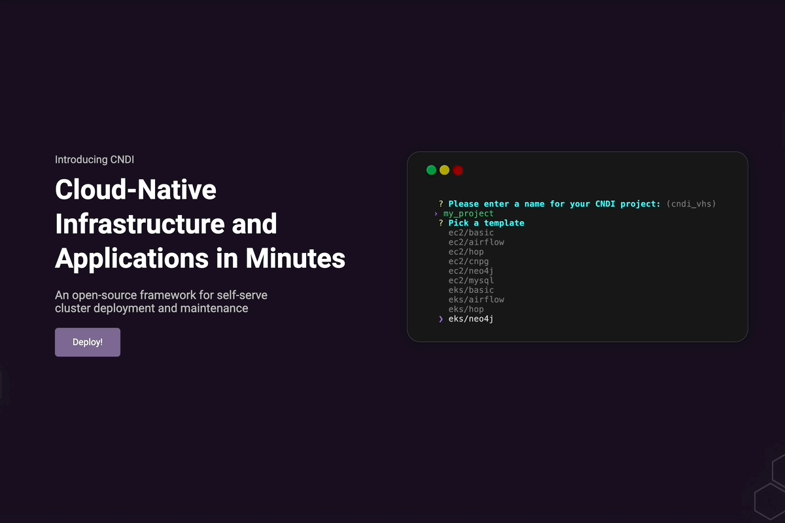

October is here!!!!! Which means that the leaves are changing, there is a mix of crisp air in the morning and more blue sky days but this also means that [Hacktober](https://hacktoberfest.com/)!!! is among us!!! which they are celebrating the 10th year of existence!!!!

What is Hacktober? It is a yearly event to encourage open source contributions where be it through code or no code issues! [Registration](https://hacktoberfest.com/) is open now with lots of projects awaiting for help!

## Upcoming Events

**(TONIGHT)** - **[JS Workshop for Women Developers](https://www.meetup.com/torontojs/events/296156813/) [In Person] - (at Capacity).** This workshop covers topics like writing documentation and public speaking!

**(October 12th from 2pm - 6pm)** - We are introducing a new type of event called [JS Website Club](https://guild.host/events/js-website-club-1-3bi8wo)! Bring your laptop, write a blog post. We can also help figuring out tech stacks, buying domains or figure out hosting. Any experience level can join, because WordPress is still a thing too!

**(October 22nd from 4pm - 6pm) -** The monthly online Code Club will be happening! [Register here](https://guild.host/events/js-code-club-october-jaxjra) to attend! These monthly events are to bring your projects that you have been thinking of building, you are currently working on or it gives an opportunity to collaborate with fellow folks in tech on the projects they are working on! All levels of knowledge welcomed :)

**Other events happening in Toronto:**

- **October 10** - Civic Hacknight hosted by Civic Tech Toronto. For the month of October the focus will be on housing in the city of Toronto. This will both be an [in-person](https://www.meetup.com/civic-tech-toronto/events/296488681/) and [virtual](https://www.meetup.com/civic-tech-toronto/events/296488674/) event.
- **October 10** - Syntax hosted at Mascot Brewery. A laid-back [event](https://www.eventbrite.com/e/toronto-syntax-meetup-tickets-727684041557?aff=oddtdtcreator) for all web developers and coding enthusiasts!
- **October 19** - Rangle.io is hosting their ReactTO fall edition [event](https://www.meetup.com/reactto/events/295659692/)! The event will focus on the how to use state management for some of the state management libraries out there.
- **October 23** - Tech Tank is back with another [event](https://www.meetup.com/techtank-to/events/296408305/) hosted at the Cohere office. Large Language Models: What Are They And How Do We Use Them?

## Community Showcase

Canadian startup Polyseam is building [[CNDI](https://cndi.run/gh?utm_content=torontojs_newsletter&utm_campaign=torontojs_newsletter&utm_source=tldr.torontojs.com&utm_medium=newsletter&utm_id=5090)]. It's a free and open source tool for self-hosting popular open source projects and they're doing it using [Deno](https://deno.com/) (a Next-generation JavaScript Runtime)!

For a complete demo of the tool, check out this [walkthrough](https://www.youtube.com/watch?v=k-Ua0nXhVVQ)!

Mike Vautour has released his second video of documenting building a personal [portfolio project](https://www.youtube.com/watch?v=_-EfN2-jdA0) using Payload CMS in public. For this video he says that "there are a couple sections that require an unknown number of elements so we will use array type collections to handle those inputs".

## Industry News

New changes have landed for Remix v2 and Next.js 13.5!!!

First off! What is [Remix](https://remix.run/)? Remix is a full stack web framework that lets you focus on the user interface. It is built on the Web Fetch API (instead of Node), that allows the code to be run anywhere.

With adjustments to the minimum version support for Remix v2, it now officially requires React 18 as well as Node 18 or later to use. There has been added changes with removals of future flags from the remix.config.js file, as well as lots of changes/API removals that had a lot of deprecation warnings in Remix v1. For all the changes with v2, they can be viewed [here](https://github.com/remix-run/remix/releases/tag/remix%402.0.0)!

Now Next.js 13.5. Developers have been complaining about the slowness of the Next.js dev server lately, so these changes with 13.5 will increase that! 22% faster startup, 29% faster HMR (fast refresh), 40% less memory usage, optimized package imports and **over 438 bugs patched! wow!** Read about all the changes with Next.js [here](https://nextjs.org/blog/next-13-5)!
