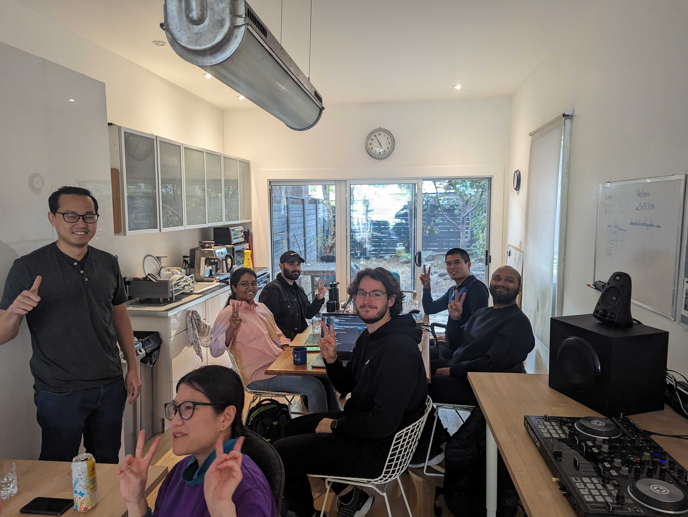

Hey folks, let's talk security because the season is spooky!

Starting with the basics: [have I been pwned](https://haveibeenpwned.com/) is a website where you can check if your email has shown up in data breaches.

If you want a video explanation on the site and why it is important, here it is:

<iframe src="https://www.youtube-nocookie.com/embed/OnpQNLrzoW0" width="300" height="400" frameborder="no" scrolling="no" loading="lazy" allowtransparency="true" allowfullscreen="true" credentialless="true" referrerPolicy="no-referrer" sandbox="allow-scripts allow-same-origin" allow="accelerometer 'none'; ambient-light-sensor 'none'; autoplay 'none'; battery 'none'; browsing-topics 'none'; camera 'none'; display-capture 'none'; domain-agent 'none'; document-domain 'none'; encrypted-media 'none'; execution-while-not-rendered 'none'; execution-while-out-of-viewport ''; gamepad 'none'; geolocation 'none'; gyroscope 'none'; hid 'none'; identity-credentials-get 'none'; idle-detection 'none'; local-fonts 'none'; magnetometer 'none'; microphone 'none'; midi 'none'; otp-credentials 'none'; payment 'none'; picture-in-picture 'none'; publickey-credentials-create 'none'; publickey-credentials-get 'none'; screen-wake-lock 'none'; serial 'none'; speaker-selection 'none'; usb 'none'; window-management 'none'; xr-spatial-tracking 'none'", csp="sandbox allow-scripts allow-same-origin"></iframe>

If you want to get geeky and dive into the rabbit hole on the breach that started everything and the logic behind it on a funny way, this XKCD comic is for you ([here is the explained page](https://explainxkcd.com/wiki/index.php/1286:_Encryptic), because I'm not so smart to understand the pun without someone explaining it to me):

Link to the explanation of this comic: [https://explainxkcd.com/wiki/index.php/1286:_Encryptic](https://explainxkcd.com/wiki/index.php/1286:_Encryptic)

Now to the next point: use a password manager, but don't pick anyone as they are [also susceptible to attacks and breaches](https://www.youtube.com/watch?v=WfHnF66L-Os).

If you want to understand how a password manager works, here is a video explaining that:

<iframe src="https://www.youtube-nocookie.com/embed/w68BBPDAWr8" width="300" height="400" frameborder="no" scrolling="no" loading="lazy" allowtransparency="true" allowfullscreen="true" credentialless="true" referrerPolicy="no-referrer" sandbox="allow-scripts allow-same-origin" allow="accelerometer 'none'; ambient-light-sensor 'none'; autoplay 'none'; battery 'none'; browsing-topics 'none'; camera 'none'; display-capture 'none'; domain-agent 'none'; document-domain 'none'; encrypted-media 'none'; execution-while-not-rendered 'none'; execution-while-out-of-viewport ''; gamepad 'none'; geolocation 'none'; gyroscope 'none'; hid 'none'; identity-credentials-get 'none'; idle-detection 'none'; local-fonts 'none'; magnetometer 'none'; microphone 'none'; midi 'none'; otp-credentials 'none'; payment 'none'; picture-in-picture 'none'; publickey-credentials-create 'none'; publickey-credentials-get 'none'; screen-wake-lock 'none'; serial 'none'; speaker-selection 'none'; usb 'none'; window-management 'none'; xr-spatial-tracking 'none'", csp="sandbox allow-scripts allow-same-origin"></iframe>

Now for the last bit of news on security: [Google is making passkeys the default for new accounts](https://blog.google/technology/safety-security/passkeys-default-google-accounts/).

And "what are passkeys" you might ask, in short, they are a more secure way to confirm identity than passwords, as they rely on public key cryptography.

Here are some links about passkeys:

- Explanation for non tech people: [https://www.youtube.com/watch?v=VuzddtQZeT8](https://www.youtube.com/watch?v=VuzddtQZeT8)
- More technical docs from Google: [https://developers.google.com/identity/passkeys/](https://developers.google.com/identity/passkeys/)
- How to implement passkeys in login forms: [https://www.youtube.com/watch?v=_qSCYiU_Yr4](https://www.youtube.com/watch?v=_qSCYiU_Yr4)

Now for something completely different…

## Past Events

The first [Website Club](https://guild.host/events/js-website-club-1-3bi8wo) was a huge success! The event brought together people to share their experiences on building and improving their own websites. And also working with the community to fix bugs.

## Upcoming Events

**October 21st** - [A Walk in the Park](https://guild.host/events/a-walk-in-the-park-c5d468)

**October 22nd** - [JS Code Club - October 2023](https://guild.host/events/js-code-club-october-jaxjra)

**October 23rd** - [Large Language Models: What Are They And How Do We Use Them?](https://www.meetup.com/techtank-to/events/296408305/)

**November 26th** - [JS Social: OpenTTD Online](https://guild.host/events/js-social-openttd-online-a76bbz)

## Community Showcase

A shout to Daniel Stoianov's mom who is making some cute "pair programming buddies".

She lives in Ukraine and since February 2022, she has been doing volunteer work daily related to supporting veterans. She also volunteers in a kitchen that prepares food for the army. Before this, she made toys that were sold at charity auctions. She gifts many of these toys to soldiers, who use them as talismans in the trenches.

To show your support for Daniel and his mom follow this slack thread: [https://torontojs.slack.com/archives/C06HNH45U/p1697067738850839](https://torontojs.slack.com/archives/C06HNH45U/p1697067738850839)

Now, a shout out to a full past week with lots of people showing their projects!

- Gregory shared a server where people could interact and control their robot car.

- Evert Pot published a [blog post reflecting on the job market and working 80% of the regular work schedule](https://evertpot.com/on-80-percent-jobs/).

- Adan published a [blog post on migrating a blog from Hugo to Astro](https://mckerlie.com/posts/migrating-your-blog-from-hugo-to-astro).

- Divish shared their [personal project](https://github.com/divishram/Youtube-downloader) for a Youtube downloader written in react, node.js and socket.io.

- Liz shared a [project](https://github.com/GingerKiwi/302-gingerkiwi-redirect-vercel) for a custom 302 redirect page for Vercel.

## Support Toronto JS

If you happen to have a few bucks laying around or would just want to help our community to grow and maintain itself, head to our [Open Collective page](https://opencollective.com/torontojs) and make a contribution!
