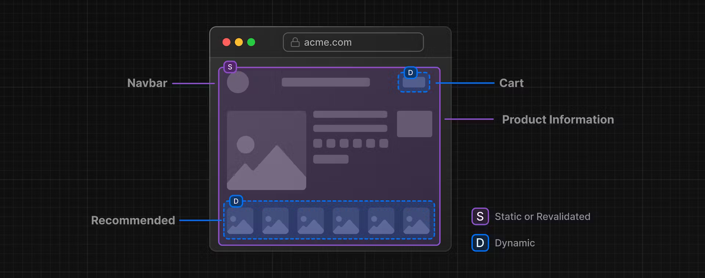

We are starting this issue off by honouring [Jen Chan](https://www.jenchan.biz/)! As the year comes to an end, Jen will be stepping down as Executive Director for TorontoJS. Jen has been a trailblazer with helping lead the organization through the pandemic years and overseeing a large part of growth in the community.

Through figuring how to bring events online, returning to in-person events, mentoring new event organizers, onboarding volunteers, organizing a donation drive for TorontoJS self-sustainability, expanding the spirit of life, light and love which is the core of our community, Jen will be missed! We wish her all the best in future endeavours. If you see Jen at an upcoming event then please thank her for the time, effort and contribution she has put into our community!

## Upcoming TorontoJS Events

- [TorontoJS Social (In-Person)](https://guild.host/events/toronto-js-social-in-27ewzx) - TONIGHT!!!!
- **November 19th at 2:00pm** - [TorontoJS Code Club (Online)](https://guild.host/events/code-club-online-november-czcet9)
- **November 26nd** **at 1:00pm** - [JS Social: OpenTTD (Online)](https://guild.host/events/js-social-openttd-online-a76bbz) - Love public transit? Play a 30 year old game together, online!
- **December 6th at 6pm -** [JS Tech Talk (In-Person): Simplify Complex Apps, React and React native Code Share, Apollo Caching](https://guild.host/events/js-tech-talk-inperson-wku7de)

### Other events happening in Toronto

- **November 28th at 7:00pm** - [Civic hacknight #421 - AMA with the City of Toronto's Deputy CTO (In-Person)](https://www.meetup.com/civic-tech-toronto/events/297055772/rsvp/)
- **November 30th at 6:00pm** - [You've deployed... But how is your app performing? (In person)](https://www.meetup.com/techtank-to/events/297145894/)
- **November 30th at 6:00pm** - [Toronto Tech Social (In-Person hosted by BrainStation)](https://www.meetup.com/brainstation-toronto-tech-skills-and-careers/events/296080107/)

## Industry News

Next.js introduces a trial run of [partial rendering](https://nextjs.org/learn/dashboard-app/partial-prerendering)! This an optional option leading to possible feature updates in coming time. With most web applications built today, we are given the choice of static or dynamic rendering. There is also routes that has both static and dynamic content though! For example, a social media feed, static rendering for posts but dynamic rendering for likes.

Introducing partial rendering! _**"Partial Prerendering is an experimental feature that allows you to render a route with a static loading shell, while keeping some parts dynamic. In other words, you can isolate the dynamic parts of a route."**_

_[Source of Image](https://nextjs.org/learn/dashboard-app/partial-prerendering)_

What does this mean and how can it benefit developers? When the static shell route is served, the load time is fast, ignoring the dynamic content that is on the page. The shell then leaves gaps for the dynamic content that will load asynchronously! _COOL!_ Then the async gaps are loaded which reduces the load time of the overall page! _How NEAT!!!!!_

Here are some steps to help you step up your personal project using [Partial Rendering](https://nextjs.org/docs/app/api-reference/next-config-js/partial-prerendering)!

## Support TorontoJS

If you happen to have a few bucks laying around or would just want to help our community to grow and maintain itself, head to our [Open Collective page](https://opencollective.com/torontojs) and make a contribution!
