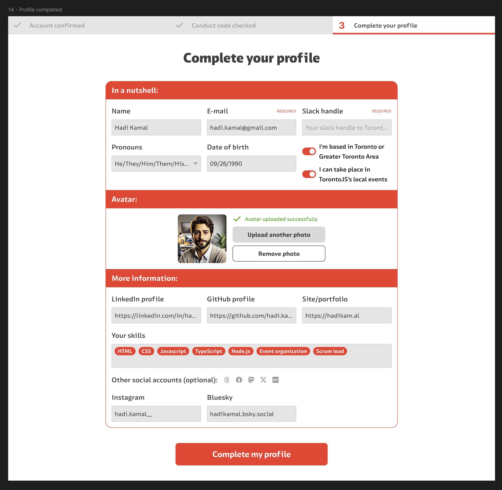

# TorontoJS Projects!

Hey everyone, I'm really excited today to introduce one of our new initiatives, TorontoJS Projects.

These are homegrown projects our community is building to give us new ways to interact and have fun together, and the very first one is our new TorontoJS Community Hub!

## TorontoJS Community Hub

I'm really excited about this -- it gives us a way to collaborate outside of our chat channels and events, and to build up an online presence for our projects, our teams, and our community in a space that we're building and managing ourselves. We'll be able to highlight all the amazing contributions that people make to our community on their profile pages and our team pages, and show off the cool things we're doing together like our events and projects. And it's a place to add fun features like badges, awards, kudos, timelines, and games!

Here's a sneak peek to whet your appetites until the team shares more details.

It's been great watching this come together. The developers, designers, and project organizers have all done an incredible job, kudos to @Lyla @Manvinder (Manny) @Evan @Mariana @Shakila @Sarthak Gupta @Ibraheem @Lean De Leon @Cadu Carvalho @Zin @Evert @Ken and @Marco for their hard work on this!

Working together on a project like this is a wonderful way to learn things, regardless of whether you're a just starting out and want to get some amazing portfolio material, an experienced engineer who wants to give back to the community, or are looking to get some experience in leading a team -- the beautiful thing about these TorontoJS projects is that there's room for everyone to work together and grow and learn, as we build fun things for our community!

## Testimonials

I asked some of the folks working on this project to say a few words about their experiences, because it's been such a fantastic journey for everyone involved.

@Cadu Carvalho
> “It was amazing to have the community open to our ideas and methods in UX research and discovery stages. As designers, our team found joy hearing the community, learning from them, and transforming these lessons into wireframes, a small design system, and a handful of directives for many more deliverables to come.”

@Lyla
> "It was great to collaborate with supportive people! The technical discussions encouraged me to study fundamental concepts more and gain new knowledge."

@Ken
> "Marco Campos' inspiring leadership style and insightful code reviews  have played a key role in enhancing my software engineering journey!  I've learned something new  from every member in the team during meetings and pair coding sessions."

@Manvinder (Manny)
> "Collaborating and pair coding with experienced developers and designers provided exposure to their thought processes and intuitive approaches to design solutions and yielded alternative insights to tackle problems, levelling up my skill set in the process."

@Mariana
> "Leading the design team on an exciting project to build a user-friendly platform for the TorontoJS community. Collaborating with designers and developers, gathering user feedback, and making data-driven decisions to enhance the experience for volunteers and organizers. Looking forward to seeing it come to life and make an impact!"

## Let's build together!

Have an idea for a project that we can build together? Maybe a calendar of events and happenings, or an SVG timeline of our history and future, a game we can play together, a slot machine for deciding location and theme for flash social events -- anything that draws people together and is fun or functional for our community is great! Reach out to us in #orgmode or feel free to ping me (@dann) directly in our Slack. 

## Next time

This is actually the first in a series of posts about cool things our community is doing -- next time we'll look at our brand new Community Supported Projects program, and highlight the first CSP, @Evert's OAuth server (https://github.com/curveball/a12n-server)!

