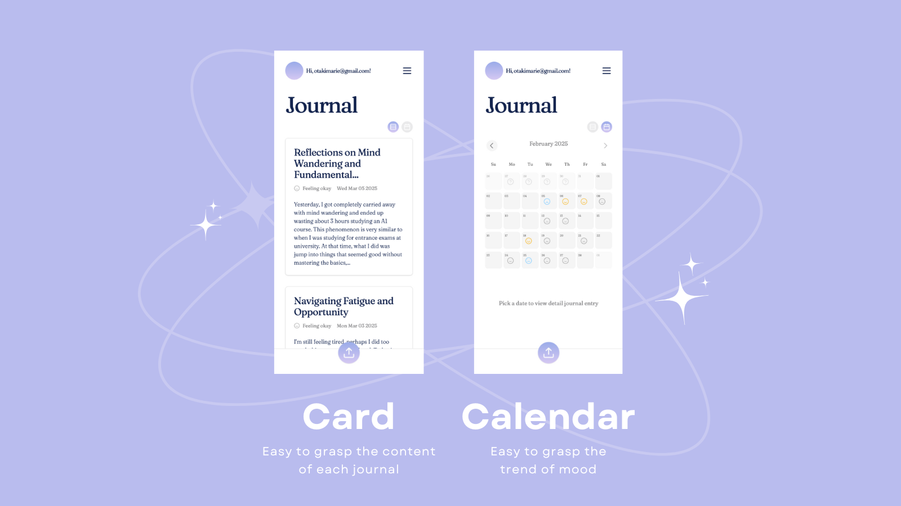

Hey all!

I've been working on my personal project, MoodScribe, for a while to solve my own problem but hopefully help others with similar challenges. In this post, I'll share how I came up with the idea, tech stack that I used, core implementations and so on.

## What is MoodScribe?

MoodScribe is a journal app that extracts text data from handwritten journal images, analyzes emotions, and tracks records. It enables you to grasp your emotional trends: what makes you feel happy or feel down to better understand yourself.

## My personal motivation

Writing journals by hand has been my habit for a decade, helping me better understand myself. However, it was really hard to keep all the notebooks from the past to the present. Additionally, I was hoping to observe myself more objectively, similar to the CBT(Cognitive Behavioral Therapy) method. I tried using digital apps a few times, but completely replacing the handwritten experience was difficult for me. This is when I came up with the idea. Yes, I made it for myself and those who are in similar situations.

## Tech stack overview

For MoodScribe, I selected a stack that balanced my existing expertise with the app's unique requirements:

### 🚀 [Next.js](https://nextjs.org)

I leveraged Next.js for its server-side rendering capabilities and built-in API routes, eliminating the need for a separate backend while providing optimal performance for a content-focused journal app.

### 🧠 [OpenAI API](https://openai.com)

The OpenAI API serves dual purposes: converting handwritten journal images to text through GPT-4o-mini's vision capabilities and performing nuanced sentiment analysis for mood scoring. Using one API for both tasks simplified the architecture considerably.

### 🔐 [Supabase](https://supabase.com)

Supabase provides a complete backend solution with authentication, PostgreSQL database, and storage capabilities. Its row-level security ensures users can only access their own journal entries, while the familiar SQL foundation means I'm working with technology I already know.

These technologies work seamlessly: journal images flow from the Next.js frontend to backend API communicating with OpenAI for processing, with results stored and retrieved via Supabase.

## Core Technical Implementation

### Image to Text Conversion

The system allows users to upload handwritten journal images through a simple file select/drag-and-drop interface. Once uploaded, the image is processed by OpenAI's GPT-4o-mini model, which:

- Extracts text content from the journal image (OCR)
- Analyzes emotional tone/sentiment
- Generates an appropriate title
- Scores the overall mood on a scale of 1-10
- Returns the response in JSON format for easy client-side handling

## User Interface Design

I built the Figma design from scratch to ensure cohesive design throughout the entire app, guided by principles from ["Refactoring UI"]("https://www.refactoringui.com/") by the Tailwind CSS creators. The app supports both:



- Card view: Quickly grasp the content of journals
- Calendar view: Visualize mood trends at a glance

The upload feature, being core to the app's functionality, is always accessible, sticking to the bottom of the feed for intuitive user interaction.

## Key Challenges and Solutions

I started creating an MVP using [v0]("https://v0.dev/"). It's great to have something that works so quickly, but I decided to take time to review the architecture because I wanted to transform it from "something that just works" to a design that's easier to scale and has better performance. Here are the main challenges I faced and how I solved them:

### Challenge: Mixed Data Fetching and Presentation Logic
**Problem:** My client components were handling both data fetching and UI rendering simultaneously. This created tightly coupled code where database queries were mixed with presentation logic.

**Solution:** Separated concerns by moving data fetching to server components using Next.js 15 app router.
- Created server components that handle data retrieval and pass only necessary data to client components
- Client components now focus solely on presentation
- This creates a clear separation between data access and UI rendering

### Challenge: Security Risks with Client-Side Database Queries
**Problem:** Database credentials and queries were potentially exposed to client browsers, creating significant security vulnerabilities.

**Solution:** Implemented server-only package to enforce server-side data operations.
- Added [server-only]("https://nextjs.org/docs/app/building-your-application/rendering/composition-patterns#keeping-server-only-code-out-of-the-client-environment") import to files containing database queries
- This creates a boundary that prevents client components from importing `server-only` code
- If you try to import `server-only` code in a client component, Next.js gives an immediate error
- Ensures all database operations and credentials stay strictly on the server

### Challenge: Code Duplication Violating DRY Principle
**Problem:** I had identical database query code repeated across multiple components. When I searched my codebase for `fetchJournal`, I found the exact same code in three different places.

**Solution:** Centralized all database queries in one file for easier maintenance.
- Created a dedicated queries file with all database operations
- Organized queries as methods of a single object (e.g., `queries.getJournalById()`)
- When changes are needed (like removing a field), I only need to update one place
- Provides TypeScript suggestions/autocompletion for available query methods

```javascript
// This is a JavaScript code block
export const QUERIES = {
  getJournalEntries: async function () {
    const supabase = await createClient();
    const { data: journalEntries, error: fetchError } = await supabase
      .from("xxx")
      .select("id, text_data, title, mood, created_at")
      .order("created_at", { ascending: false });

    if (fetchError) throw Error("Error fetching diary entries");

    return journalEntries as JournalEntry[];
  },

  getJournalById: async function () {
    // code to select journal by ID
  },

  updateJournalById: async function () {
    // code to update journal by ID
  },
};
```

### Key Benefits

These architectural improvements delivered three major benefits:

1. **Performance:** Eliminated network roundtrips between client and server when fetching data. Database queries now happen only on the server side, which speeds up communication and reduces JavaScript bundle size.

2. **Security:** Credentials and connection details remain server-side only and are never exposed to the client browser. The server-only package creates a hard boundary that prevents accidental exposure.

3. **Maintainability:** Improved code organization with clear separation of concerns makes the codebase easier to understand and extend. Centralized database queries eliminate duplication and simplify future changes.

This approach follows best practices for Next.js applications and creates a more robust foundation as the app continues to grow.


## What's Next for MoodScribe?

As I continue developing MoodScribe, here are some exciting features on the horizon:

- Better onboarding process
- Improved performance with infinite scroll
- Graph view to grasp the major trend of emotions
- AI-based advice on your behavior trends to help improve your thinking patterns

## Interested in trying it out?

MoodScribe is currently in beta version. If you're interested,feel free to check out [the link](https://moodscribe.vercel.app/).

I look forward to hearing your feedback!
