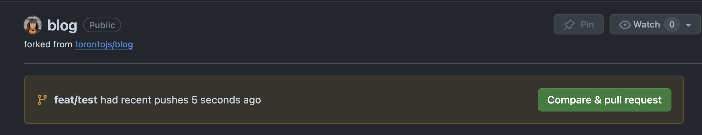

# Contributing to Toronto JS blog

To contribute with code changes for the blog, you will need to clone the repository, create a branch, make your changes, and submit a pull request.

If you are looking for instructions on how to _write posts_ for the blog, please refer to the [Writing blog posts](writing-posts.md) documentation.

## Cloning the repository

We recommend creating a fork of the project, that can be easily done by clicking the "Fork" button on the top right corner of the repository page.


After forking the project, you can clone your forked repository to your local machine by running the following command:

```shell
git clone <your forked repository URL>
```

Replace `<your forked repository URL>` with the URL of your forked repository. You can find the URL by clicking the "Code" button on the top right corner of your forked repository page.


## Creating a branch

After cloning the repository, move into the folder where you have cloned the repo. Then to create a branch, run the following command:

```shell
git checkout -b <branch-name>
```

Replace `<branch-name>` with a descriptive name for your branch. We recommend using the following naming convention for your branch: `feature/<feature-name>` or `fix/<issue-name>`. that way it's easier to understand what the branch is about.

Add a descriptive name to your feature/fix, so it's easier to understand what the branch is about. For example, if you are adding a list of posts to the blog, you could name your branch `feature/add-posts-list`. If you are fixing a bug with the navbar CSS, you could name your branch `fix/issue-123` or `fix/navbar-css`.

## Submitting a pull request

Once you have made your changes, commit them all and push your branch to the remote repository and submit a pull request.

Open your fork's page on GitHub and you will see a message with a button saying "Compare & pull request"



You can also create a Pull Request by going to the [original repository](https://github.com/torontojs/blog), going to the "Pull Requests" tab and then clicking "New Pull Request". Once there, click on the link called "compare across forks" and it will allow you to see the changes between your fork and the original repository.


After creating the Pull Request, we will review your changes and merge them into the main branch if they are approved.
